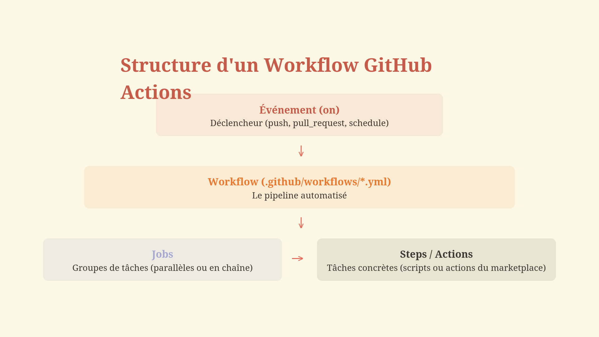

# Tutoriel GitHub Actions - MLOps Lab


Ce tutoriel a été créé dans le cadre du programme de formation [**Académie des Mathématiques Appliquées (AMA)**](https://www.linkedin.com/company/bourseama/) pour apprendre à utiliser GitHub Actions dans un contexte MLOps.

**Prérequis** : Maîtriser [Git et Github](https://github.com/elias-ba/git-workshop)

---

## Qu'est-ce que GitHub Actions ?

GitHub Actions est une plateforme d'intégration continue et de déploiement continu (CI/CD) intégrée directement à GitHub. Elle permet d'automatiser vos workflows de développement logiciel directement depuis votre dépôt GitHub.

### Concepts clés

- **Workflow** : Un processus automatisé configurable qui exécute un ou plusieurs jobs
- **Event** : Une activité spécifique qui déclenche l'exécution d'un workflow (push, pull request, etc.)
- **Job** : Un ensemble d'étapes (steps) qui s'exécutent sur le même runner
- **Step** : Une tâche individuelle qui exécute des commandes ou des actions
- **Action** : Une application réutilisable qui effectue une tâche complexe mais fréquente
- **Runner** : Un serveur qui exécute vos workflows (hébergé par GitHub ou auto-hébergé)





### Avantages de GitHub Actions

- **Intégration native** : Directement intégré à GitHub, pas besoin de service externe
- **Gratuit pour les projets publics** : Minutes d'exécution illimitées pour les dépôts publics
- **Écosystème riche** : Accès à des milliers d'actions réutilisables via la [GitHub Marketplace](https://github.com/marketplace?type=actions)
- **Multi-plateforme** : Support de Linux, Windows et macOS
- **Flexible** : Supporte tous les langages et frameworks

### Ressources utiles

- [Documentation officielle GitHub Actions](https://docs.github.com/en/actions)
- [GitHub Actions Marketplace](https://github.com/marketplace?type=actions)
- [Awesome Actions](https://github.com/sdras/awesome-actions) - Liste d'actions communautaires


## Guide YAML pour GitHub Actions

### Qu'est-ce que YAML ?

YAML (YAML Ain't Markup Language) est un format de sérialisation de données lisible par l'humain. GitHub Actions utilise YAML pour définir les workflows.

### Règles de Base

#### 1. Indentation
- **TOUJOURS utiliser des espaces** (jamais de tabulations)
- **2 espaces** par niveau d'indentation
- L'indentation définit la hiérarchie

```yaml
parent:
  enfant:
    petit_enfant: valeur
```

#### 2. Structures de Données

**Scalaires (valeurs simples)**
```yaml
nom: "Alice"
age: 25
actif: true
score: 3.14
```

**Listes (arrays)**
```yaml
# Style 1: avec tirets
fruits:
  - pomme
  - banane
  - orange

# Style 2: inline
couleurs: [rouge, vert, bleu]
```

**Dictionnaires (objets)**
```yaml
personne:
  nom: Alice
  age: 25
  ville: Paris
```

#### 3. Commentaires
```yaml
# Ceci est un commentaire
name: Mon Workflow  # Commentaire en fin de ligne
```

#### 4. Chaînes de Caractères

```yaml
# Sans guillemets (simple)
message: Bonjour tout le monde

# Avec guillemets doubles (permet l'échappement)
message: "Ligne 1\nLigne 2"

# Avec guillemets simples (littéral)
message: 'Il a dit: "Bonjour"'

# Multi-lignes avec |
script: |
  echo "Ligne 1"
  echo "Ligne 2"
  echo "Ligne 3"

# Multi-lignes avec > (remplace les retours par des espaces)
description: >
  Ceci est une très longue description
  qui sera sur une seule ligne.
```

#### 5. Valeurs Spéciales

```yaml
valeur_nulle: null
valeur_vide: ~
booleen_vrai: true
booleen_faux: false
```

### Structure d'un Workflow GitHub Actions

```yaml
# Nom du workflow (optionnel mais recommandé)
name: Mon Premier Workflow

# Déclencheur(s)
on: push

# Jobs à exécuter
jobs:
  nom-du-job:
    runs-on: ubuntu-latest
    steps:
      - name: Première étape
        run: echo "Hello"
```

### Pièges Courants à Éviter

**Erreur : Tabulations**
```yaml
jobs:
    build:  # ❌ Utilise des tabulations
```

**Correct : Espaces**
```yaml
jobs:
  build:  # ✅ Utilise des espaces
```

**Erreur : Indentation incorrecte**
```yaml
jobs:
  build:
  runs-on: ubuntu-latest  # ❌ Mauvaise indentation
```

**Correct**
```yaml
jobs:
  build:
    runs-on: ubuntu-latest  # ✅ Bonne indentation
```

**Erreur : Caractères spéciaux non échappés**
```yaml
message: Il m'a dit: "Bonjour"  # ❌ Guillemets non échappés
```

**Correct**
```yaml
message: "Il m'a dit: \"Bonjour\""  # ✅ Guillemets échappés
# ou
message: 'Il m''a dit: "Bonjour"'
```

### Validation YAML

**En ligne de commande (avec Python)**
```bash
python -c "import yaml; yaml.safe_load(open('workflow.yml'))"
```

**Éditeurs recommandés**
- **VS Code** avec extension "YAML" par Red Hat
- **PyCharm** (support natif)
- Validation en ligne : [yamllint.com](http://www.yamllint.com/)

### Syntaxe GitHub Actions Spécifique

**Variables d'environnement**
```yaml
env:
  MA_VARIABLE: valeur
  PYTHON_VERSION: 3.9
```

**Expressions**
```yaml
# Utilise la syntaxe ${{ }}
if: ${{ github.ref == 'refs/heads/main' }}
run: echo "Branch: ${{ github.ref }}"
```

**Secrets**
```yaml
env:
  API_KEY: ${{ secrets.MA_CLE_API }}
```

### Résumé des Bonnes Pratiques

**À FAIRE**
- Utiliser 2 espaces pour l'indentation
- Valider votre YAML avant de committer
- Ajouter des commentaires pour expliquer les sections complexes
- Utiliser des noms descriptifs pour les jobs et steps

**À ÉVITER**
- Les tabulations
- L'indentation incohérente
- Les fichiers sans validation préalable
- Les noms génériques comme "job1", "step1"

---

## Création de votre premier workflow

### Structure des dossiers

GitHub Actions recherche automatiquement les workflows dans un emplacement spécifique de votre dépôt :

```
votre-repo/
└── .github/
    └── workflows/
        ├── workflow1.yml
        ├── workflow2.yml
        └── ...
```

### Importance de la structure `.github/workflows/`

- **`.github/`** : Dossier spécial reconnu par GitHub pour stocker la configuration du dépôt
- **`workflows/`** : Sous-dossier où GitHub cherche automatiquement les fichiers de workflow
- Les fichiers doivent avoir l'extension `.yml` ou `.yaml`
- Tous les fichiers YAML dans ce dossier seront automatiquement détectés et exécutés selon leurs déclencheurs

### Création du dossier workflows

**Via la ligne de commande :**
```bash
# À la racine de votre dépôt
mkdir -p .github/workflows
```

**Via l'interface GitHub :**
1. Allez dans l'onglet "Actions" de votre dépôt
2. Cliquez sur "New workflow"
3. GitHub créera automatiquement la structure nécessaire

### Création d'un fichier workflow

**Méthode 1 : Via l'interface GitHub**
1. Allez dans "Actions" > "New workflow"
2. Choisissez "set up a workflow yourself"
3. Éditez le fichier directement dans le navigateur

**Méthode 2 : En local**
```bash
# Créez un nouveau fichier workflow
touch .github/workflows/mon-premier-workflow.yml

# Éditez avec votre éditeur préféré
code .github/workflows/mon-premier-workflow.yml
```

### Vérification et activation

Une fois le fichier créé et poussé sur GitHub :
1. Allez dans l'onglet "Actions" de votre dépôt
2. Votre workflow apparaîtra dans la liste
3. Il s'exécutera selon les déclencheurs définis (push, pull_request, etc.)

### Marketplace GitHub Actions

La [GitHub Marketplace](https://github.com/marketplace?type=actions) offre des milliers d'actions prêtes à l'emploi :

- **Actions officielles** : Maintenues par GitHub (ex: `actions/checkout`, `actions/setup-python`)
- **Actions communautaires** : Créées par la communauté open-source
- **Actions vérifiées** : Validées par GitHub pour la sécurité et la qualité

**Exemples d'actions populaires :**
- `actions/checkout@v4` : Clone votre dépôt
- `actions/setup-python@v5` : Configure un environnement Python
- `docker/build-push-action@v5` : Build et push d'images Docker
- `aws-actions/configure-aws-credentials@v4` : Configuration AWS

**Utilisation d'une action du Marketplace :**
```yaml
steps:
  - uses: actions/checkout@v4
  - uses: actions/setup-python@v5
    with:
      python-version: '3.11'
```

---

## Workflows du Tutoriel


Ce tutoriel est organisé en une série de workflows progressifs pour apprendre GitHub Actions étape par étape :

### Workflows de base

1. **[01-hello-world.yml](.github/workflows/01-hello-world.yml)**  
   Premier workflow simple affichant "Hello World" - Introduction aux concepts de base (name, on, jobs, steps)

2. **[02-triggers.yml](.github/workflows/02-triggers.yml)**  
   Exploration des différents déclencheurs : push, pull_request, schedule (cron), workflow_dispatch (manuel)

3. **[03-setup-python.yml](.github/workflows/03-setup-python.yml)**  
   Configuration d'un environnement Python avec `actions/setup-python` et vérification de l'installation

4. **[04-dependencies.yml](.github/workflows/04-dependencies.yml)**  
   Installation et gestion des dépendances Python avec pip et requirements.txt

### Workflows intermédiaires

5. **[05-parallel-jobs.yml](.github/workflows/05-parallel-jobs.yml)**  
   Exécution de plusieurs jobs en parallèle pour optimiser le temps d'exécution

6. **[06-sequential-pipeline.yml](.github/workflows/06-sequential-pipeline.yml)**  
   Création d'un pipeline avec jobs séquentiels et gestion des dépendances entre jobs (`needs`)

7. **[07-artefacts.yml](.github/workflows/07-artefacts.yml)**  
   Gestion des artefacts : upload et download de fichiers entre jobs avec `actions/upload-artifact` et `actions/download-artifact`

8. **[08-matrix.yml](.github/workflows/08-matrix.yml)**  
   Utilisation des matrix strategies pour tester sur plusieurs versions de Python et systèmes d'exploitation

### Workflows avancés

9. **[09-env-vars.yml](.github/workflows/09-env-vars.yml)**  
   Travail avec les variables d'environnement : définition au niveau workflow, job et step

10. **[10-conditions.yml](.github/workflows/10-conditions.yml)**  
    Exécution conditionnelle avec `if`, expressions et contextes GitHub

11. **[11-secrets.yml](.github/workflows/11-secrets.yml)**  
    Gestion sécurisée des secrets et informations sensibles avec GitHub Secrets

### Pipeline complet

12. **[12-pipelines-complet.yml](.github/workflows/12-pipelines-complet.yml)**  
    Pipeline MLOps complet intégrant tous les concepts : lint, tests, build, déploiement avec gestion d'artefacts et conditions

---

**Prochaine étape** : Explorez les workflows dans l'ordre pour une progression pédagogique optimale.

